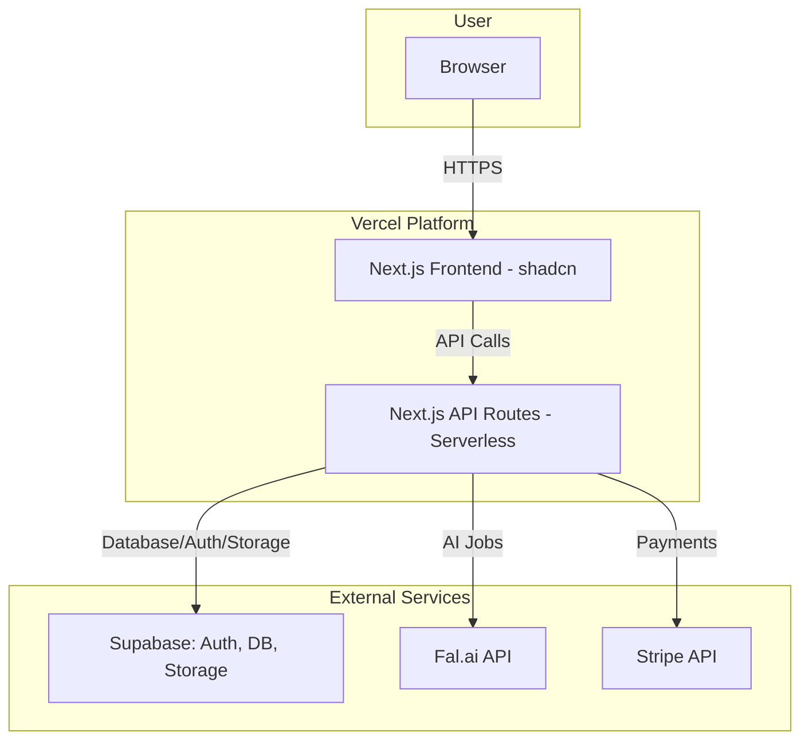

# 2\. High Level Architecture

## Technical Summary

This project will be a full-stack, serverless application built with Next.js and deployed on Vercel. It will function as a majestic monolith for the MVP, with the frontend and backend API logic co-located in a single monorepo. User data, authentication, and asset storage will be managed by Supabase, with specialized AI tasks offloaded to the external Fal.ai API and payments handled by Stripe. This architecture is designed for rapid development, automatic scaling, and cost efficiency, directly supporting the PRD's goals.

## Platform and Infrastructure Choice

  * **Platform:** Vercel and Supabase
  * **Key Services:**
      * **Vercel:** Hosting, CDN, and Serverless Functions for all backend logic.
      * **Supabase:** PostgreSQL Database, Authentication, and Storage for user-generated assets.
      * **Stripe:** Payment processing and subscription management.
      * **Fal.ai:** External API for all generative AI model execution.
  * **Deployment Host and Regions:** Vercel's standard global edge network will be used, with serverless functions primarily operating in the default `us-east-1` (N. Virginia) region.

## Repository Structure

  * **Structure:** Monorepo
  * **Rationale:** As defined in the PRD, we will use a standard Next.js project structure which naturally contains both frontend and backend code in a single repository. This is the simplest and most efficient structure for the MVP.

## High Level Architecture Diagram

## Architectural Patterns

  * **Serverless Architecture:** We will use Vercel's serverless functions for all backend logic.
      * **Rationale:** This provides automatic scaling, reduces infrastructure management overhead, and is cost-effective as we only pay for execution time.
  * **Monolithic Architecture (for MVP):** All backend API routes and business logic will reside within the single Next.js application.
      * **Rationale:** This simplifies development, testing, and deployment for the MVP, allowing for maximum iteration speed.
  * **Component-Based UI:** The frontend will be built with reusable React components using `shadcn/ui`.
      * **Rationale:** This aligns with the PRD and ensures a maintainable, consistent, and high-quality user interface.
  * **Repository Pattern (for Data Access):** We will create a data access layer to abstract direct calls to Supabase.
      * **Rationale:** This decouples our business logic from the database implementation, making the code cleaner, easier to test, and more adaptable to future changes.

-----
