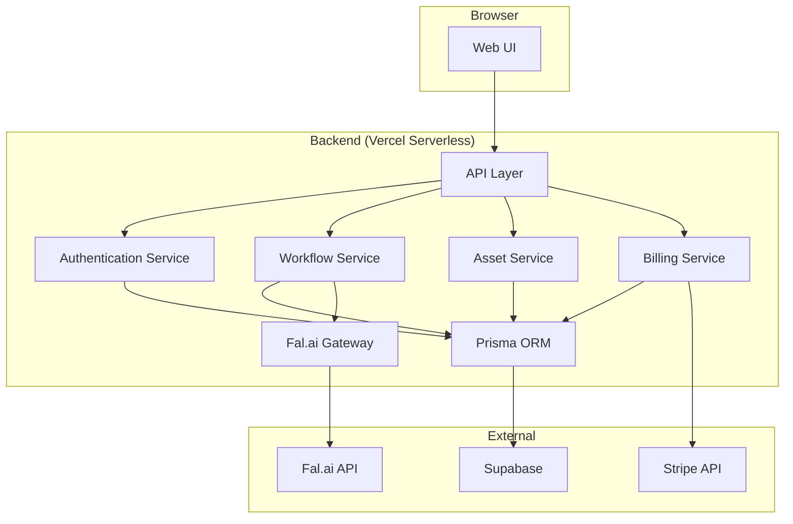

# 6\. Components

## Web UI (Next.js Frontend)

  * **Responsibility:** To render the user interface and handle all user interactions.
  * **Dependencies:** API Layer, Authentication Service.
  * **Technology Stack:** Next.js, React, shadcn/ui, Zustand.

## API Layer (Next.js API Routes)

  * **Responsibility:** To act as the secure gateway between the Web UI and our backend services.
  * **Dependencies:** Authentication Service, Workflow Service, Asset Service, Billing Service.
  * **Technology Stack:** Next.js API Routes, TypeScript.

## Authentication Service

  * **Responsibility:** To manage user identity, sessions, and role-based access control.
  * **Dependencies:** Supabase Auth, Prisma.
  * **Technology Stack:** Supabase Client SDK, Prisma Client.

## Workflow Service

  * **Responsibility:** To manage the creation, modification, and execution of user workflows.
  * **Dependencies:** Fal.ai Gateway Service, Asset Service, Prisma.
  * **Technology Stack:** TypeScript, Prisma Client.

## Fal.ai Gateway Service

  * **Responsibility:** To encapsulate all communication with the external Fal.ai API.
  * **Dependencies:** None.
  * **Technology Stack:** `@fal-ai/client`.

## Asset Service

  * **Responsibility:** To manage the lifecycle of generated assets.
  * **Dependencies:** Supabase Storage, Prisma.
  * **Technology Stack:** Supabase Client SDK, Prisma Client.

## Billing Service

  * **Responsibility:** To handle all payment and subscription logic.
  * **Dependencies:** Stripe API, Prisma.
  * **Technology Stack:** Stripe SDK, Prisma Client.

## Component Interaction Diagram

-----
