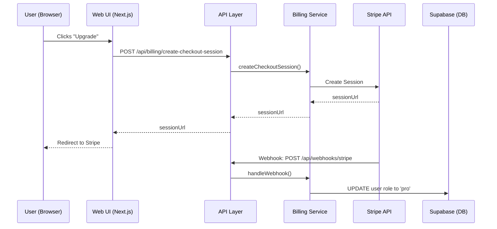
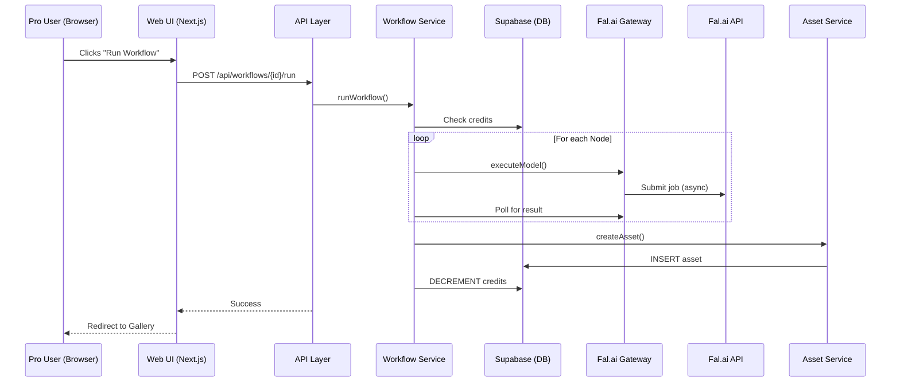

# 8\. Core Workflows

## Workflow 1: User Upgrades to Pro Plan

```mermaid
sequenceDiagram
    User (Browser)->>Web UI (Next.js): Clicks "Upgrade"
    Web UI (Next.js)->>API Layer: POST /api/billing/create-checkout-session
    API Layer->>Billing Service: createCheckoutSession()
    Billing Service->>Stripe API: Create Session
    Stripe API-->>Billing Service: sessionUrl
    Billing Service-->>API Layer: sessionUrl
    API Layer-->>Web UI (Next.js): sessionUrl
    Web UI (Next.js)-->>User (Browser): Redirect to Stripe
    Stripe API->>API Layer: Webhook: POST /api/webhooks/stripe
    API Layer->>Billing Service: handleWebhook()
    Billing Service->>Supabase (DB): UPDATE user role to 'pro'
```

## Workflow 2: Pro User Executes a Chained Workflow

```mermaid
sequenceDiagram
    Pro User (Browser)->>Web UI (Next.js): Clicks "Run Workflow"
    Web UI (Next.js)->>API Layer: POST /api/workflows/{id}/run
    API Layer->>Workflow Service: runWorkflow()
    Workflow Service->>Supabase (DB): Check credits
    loop For each Node
        Workflow Service->>Fal.ai Gateway: executeModel()
        Fal.ai Gateway->>Fal.ai API: Submit job (async)
        Workflow Service->>Fal.ai Gateway: Poll for result
    end
    Workflow Service->>Asset Service: createAsset()
    Asset Service->>Supabase (DB): INSERT asset
    Workflow Service->>Supabase (DB): DECREMENT credits
    API Layer-->>Web UI (Next.js): Success
    Web UI (Next.js)-->>Pro User (Browser): Redirect to Gallery
```

-----
