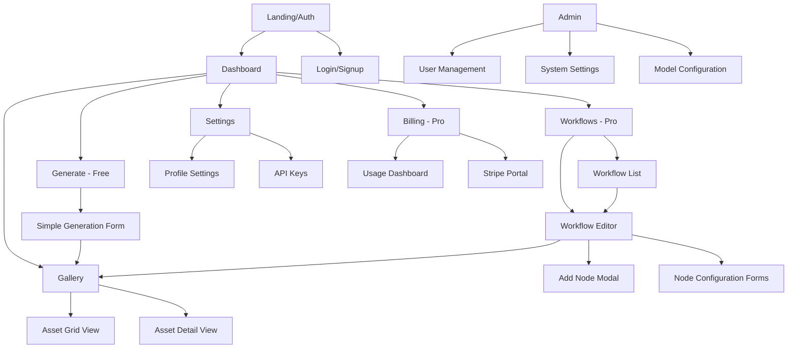
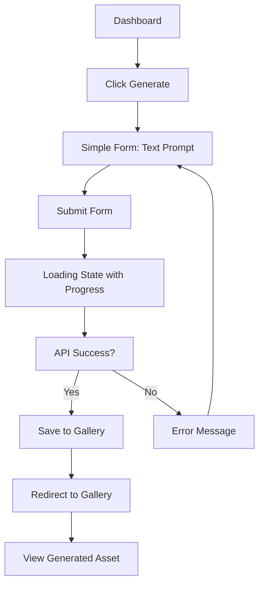
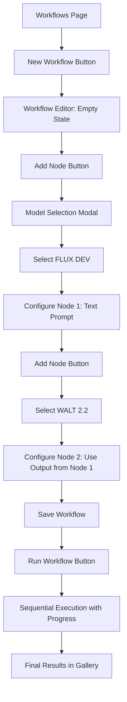
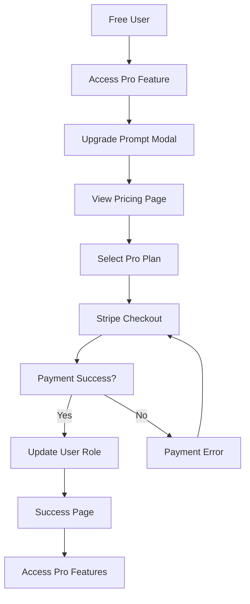

# FAL.ai Workflow Dashboard UI/UX Specification

This document defines the user experience goals, information architecture, user flows, and visual design specifications for the FAL.ai Workflow Dashboard user interface. It serves as the foundation for visual design and frontend development, ensuring a cohesive and user-centered experience.

> **📋 Technical Implementation:** For coding standards and architectural boundaries, see the [Coding Standards](./architecture/coding-standards.md) document.

## Overall UX Goals & Principles

### Target User Personas

**Founders & Product Managers:** Non-technical users who need to rapidly prototype AI workflows for business validation. They prioritize speed, simplicity, and clear results over technical complexity.

**Technical Product Teams:** Semi-technical users comfortable with forms and configuration interfaces. They need reliable workflow execution with clear feedback and debugging capabilities.

**Business Users:** Users focused on generating brand assets and marketing materials. They value consistency, quality, and the ability to iterate quickly on generated content.

### Usability Goals

- **Immediate value:** Users can generate their first AI asset within 2 minutes of signing up
- **Learning efficiency:** New users understand the workflow concept and create their first multi-step workflow within 10 minutes
- **Error clarity:** All API failures, validation errors, and system states provide clear, actionable feedback
- **Workflow reliability:** Users trust the system to execute long-running workflows without data loss or unexpected failures

### Design Principles

1. **Simplicity First** - Start with the simplest possible interface that works, then add complexity only when needed
2. **Progressive Enhancement** - Free users get immediate value, Pro users get advanced capabilities through familiar patterns
3. **Consistent shadcn Foundation** - Every UI element leverages shadcn/ui components for visual consistency and accessibility
4. **Clear Process Feedback** - Every system operation (API calls, workflow execution, file processing) shows clear progress and completion states
5. **Form-Based Interactions** - Complex configurations are broken down into familiar, well-validated forms rather than freeform interfaces

### Change Log

| Date | Version | Description | Author |
|------|---------|-------------|--------|
| 2025-09-26 | 1.0 | Initial UI/UX specification based on PRD v1.2 | Sally (UX Expert) |

## Information Architecture (IA)

### Site Map / Screen Inventory

### Navigation Structure

**Primary Navigation:** Fixed sidebar with clear iconography and role-based menu items. Free users see Generate, Gallery, Settings. Pro users see Workflows, Generate, Gallery, Settings, Billing. Admin users see additional Admin section.

**Secondary Navigation:** Breadcrumbs for deep navigation (Workflows > Workflow Name > Edit). Tab-based navigation within complex screens like Settings.

**Breadcrumb Strategy:** Show clear path for multi-level pages, especially in workflow editor and admin sections.

## User Flows

### Free User: Simple Asset Generation

**User Goal:** Generate a single AI image using a text prompt

**Entry Points:** Dashboard "Generate Now" CTA, direct navigation to /generate

**Success Criteria:** User sees their generated image in the gallery and understands how to access it later

#### Flow Diagram

#### Edge Cases & Error Handling:
- API timeout: Show retry option with clear timeout message
- Invalid prompt: Real-time validation with helpful suggestions
- Network failure: Offline message with auto-retry when connection restored
- Empty prompt: Prevent submission with inline validation

**Notes:** This flow must feel immediate and satisfying. Loading states should show estimated time and progress indicators.

### Pro User: Multi-Step Workflow Creation

**User Goal:** Create a workflow that generates a base image, then creates a video from that image

**Entry Points:** Dashboard "Create Workflow" button, Workflows page "New Workflow"

**Success Criteria:** User successfully chains FLUX DEV → WALT 2.2, executes workflow, and sees final video in gallery

#### Flow Diagram

#### Edge Cases & Error Handling:
- Node configuration errors: Inline validation before allowing workflow save
- Workflow execution failure: Clear identification of which node failed and why
- Partial workflow completion: Save intermediate results, allow retry from failure point
- Browser refresh during execution: Persist workflow state, show current status on return

**Notes:** The workflow editor must make the sequential nature of execution clear through visual design and numbering.

### User Upgrade Flow

**User Goal:** Convert from Free to Pro plan to access workflow features

**Entry Points:** Attempt to access Pro feature, Pricing page, Dashboard upgrade prompt

**Success Criteria:** User completes payment and immediately gains access to Pro features

#### Flow Diagram

#### Edge Cases & Error Handling:
- Payment failure: Clear error message with support contact
- Session timeout during checkout: Preserve selection, auto-redirect to checkout
- Duplicate payment: Detection and prevention with user notification
- Role update delay: Show temporary "processing" state with auto-refresh

## Wireframes & Mockups

**Primary Design Files:** To be created in Figma once specification is approved

### Key Screen Layouts

#### Dashboard (Free User)

**Purpose:** Provide immediate access to generation and view recent activity

**Key Elements:**
- Welcome message with user's name and current plan
- Large "Generate Now" CTA button (primary action)
- Recent assets grid (max 6 items)
- Usage indicator showing daily/monthly limits
- Clear upgrade prompt for Pro features

**Interaction Notes:** Focus on single primary action. Secondary actions (view all assets, settings) are clearly labeled but de-emphasized.

**Design File Reference:** dashboard-free.fig

#### Dashboard (Pro User)

**Purpose:** Show workflow management and advanced features

**Key Elements:**
- Recent workflows list with last run status
- "Create New Workflow" CTA
- Usage/credits remaining indicator
- Recent assets section
- Quick actions: duplicate successful workflow, view all assets

**Interaction Notes:** Balance workflow creation with asset viewing. Show workflow status clearly (draft, running, completed, failed).

**Design File Reference:** dashboard-pro.fig

#### Workflow Editor (List-Based MVP)

**Purpose:** Create and configure multi-step AI workflows through sequential forms

**Key Elements:**
- Workflow name and description at top
- Sequential list of node forms with clear numbering
- "Add Node" button between and after nodes
- Node configuration forms using shadcn components
- Run workflow button (disabled until valid)
- Save draft button (auto-save on changes)

**Interaction Notes:** Each node form expands when selected. Clear visual indication of node dependencies. Run button shows estimated cost in credits.

**Design File Reference:** workflow-editor-mvp.fig

#### Asset Gallery

**Purpose:** Browse, search, and manage all generated assets

**Key Elements:**
- Grid layout with image/video previews
- Filter by type (image/video), date, source workflow
- Search by prompt text
- Asset actions: view full size, download, use in new workflow
- Batch selection for organization

**Interaction Notes:** Responsive grid that adapts to screen size. Lazy loading for performance. Clear visual distinction between images and videos.

**Design File Reference:** gallery.fig

## Component Library / Design System

**Design System Approach:** Leverage shadcn/ui as the complete foundation. Customize theme variables and create minimal custom components only when shadcn doesn't provide needed functionality.

### Core Components

#### Workflow Node Form

**Purpose:** Configure individual AI model parameters in a workflow

**Variants:**
- Text-to-image models (prompt, dimensions, style parameters)
- Image-to-video models (input image selector, duration, quality)
- Future: Custom LoRA models, other AI providers

**States:**
- Empty (initial configuration)
- Valid (all required fields completed)
- Invalid (validation errors shown)
- Executing (read-only with progress indicator)
- Complete (with result preview)

**Usage Guidelines:** Always use shadcn Form components. Show clear visual connection to previous/next nodes. Include cost estimation for Pro users.

#### Asset Card

**Purpose:** Display generated images and videos in gallery and selection contexts

**Variants:**
- Image card (with thumbnail, prompt preview, generation date)
- Video card (with poster frame, duration, prompt preview)
- Selection mode (with checkboxes for batch operations)

**States:**
- Default (normal display)
- Hover (show additional actions)
- Selected (for workflow input or batch operations)
- Processing (during generation with skeleton loader)

**Usage Guidelines:** Consistent aspect ratio for grid layouts. Always include alt text for accessibility. Show loading states during generation.

#### Progress Indicator

**Purpose:** Show status of long-running AI generation processes

**Variants:**
- Simple progress bar (for single operations)
- Multi-step progress (for workflows with node indicators)
- Indeterminate spinner (for queued operations)

**States:**
- Queued (waiting in line)
- Processing (with estimated time if available)
- Complete (with success confirmation)
- Failed (with error details and retry option)

**Usage Guidelines:** Always provide context about what's happening. Show estimated times when possible. Make retry actions obvious for failed operations.

## Branding & Style Guide

**Brand Guidelines:** To be defined based on company brand (link to external brand guide when available)

### Color Palette

| Color Type | Hex Code | Usage |
|------------|----------|-------|
| Primary | #007AFF | Primary actions, links, brand elements |
| Secondary | #5856D6 | Secondary actions, accent elements |
| Accent | #FF9500 | Warnings, upgrade prompts, highlights |
| Success | #34C759 | Confirmations, successful operations |
| Warning | #FF9500 | Cautions, credit warnings |
| Error | #FF3B30 | Errors, failed operations, destructive actions |
| Neutral | #8E8E93, #F2F2F7, #FFFFFF | Text, borders, backgrounds |

### Typography

#### Font Families
- **Primary:** Inter (clean, professional, excellent for interfaces)
- **Secondary:** Inter (consistent across all elements)
- **Monospace:** JetBrains Mono (for code, API keys, technical details)

#### Type Scale

| Element | Size | Weight | Line Height |
|---------|------|---------|-------------|
| H1 | 2rem | 700 | 1.2 |
| H2 | 1.5rem | 600 | 1.3 |
| H3 | 1.25rem | 600 | 1.4 |
| Body | 1rem | 400 | 1.5 |
| Small | 0.875rem | 400 | 1.4 |

### Iconography

**Icon Library:** Lucide React (matches shadcn/ui defaults, consistent style, excellent coverage)

**Usage Guidelines:** 16px for inline icons, 20px for buttons, 24px for navigation. Consistent stroke width. Use semantic icons (play for video, image for photos, etc.).

### Spacing & Layout

**Grid System:** CSS Grid with 12-column layout for responsive design

**Spacing Scale:** 4px base unit (4, 8, 12, 16, 24, 32, 48, 64px) following shadcn spacing conventions

## Accessibility Requirements

### Compliance Target

**Standard:** WCAG 2.1 Level AA compliance (achieved through shadcn/ui foundation)

### Key Requirements

**Visual:**
- Color contrast ratios: 4.5:1 for normal text, 3:1 for large text
- Focus indicators: Visible focus rings on all interactive elements
- Text sizing: Support 200% zoom without horizontal scrolling

**Interaction:**
- Keyboard navigation: Full keyboard access to all features
- Screen reader support: Semantic HTML, proper ARIA labels, descriptive alt text
- Touch targets: Minimum 44px for touch interfaces

**Content:**
- Alternative text: Descriptive alt text for all generated images and videos
- Heading structure: Logical heading hierarchy on all pages
- Form labels: Clear labels and error messages for all form inputs

### Testing Strategy

Manual testing with keyboard navigation and screen reader (VoiceOver/NVDA). Automated testing with axe-core. Color contrast verification with tools like Stark.

## Responsiveness Strategy

### Breakpoints

| Breakpoint | Min Width | Max Width | Target Devices |
|------------|-----------|-----------|----------------|
| Mobile | 320px | 767px | Phones (primarily read-only usage) |
| Tablet | 768px | 1023px | Tablets (workflow editing with adapted UI) |
| Desktop | 1024px | 1439px | Laptops and desktop computers |
| Wide | 1440px | - | Large screens and external monitors |

### Adaptation Patterns

**Layout Changes:** Single column on mobile, two-column on tablet, three-column on desktop for gallery. Workflow editor adapts from stacked forms to side-by-side layout.

**Navigation Changes:** Collapsible sidebar on mobile, persistent sidebar on desktop. Tab navigation converts to dropdown on narrow screens.

**Content Priority:** Mobile shows only essential actions and information. Advanced features and detailed settings available through progressive disclosure.

**Interaction Changes:** Touch-friendly targets on mobile/tablet. Hover states and detailed tooltips on desktop. Workflow editor uses full-screen modal approach on mobile.

## Animation & Micro-interactions

### Motion Principles

Subtle, purposeful motion that provides feedback and guides attention. All animations respect `prefers-reduced-motion` accessibility preference. Focus on functional animation over decorative effects.

### Key Animations

- **Page transitions:** Smooth slide transitions between major sections (Duration: 200ms, Easing: ease-out)
- **Form validation:** Shake animation for errors, checkmark for success (Duration: 300ms, Easing: bounce)
- **Loading states:** Skeleton loaders with shimmer effect (Duration: 1.5s, Easing: linear, infinite)
- **Asset generation:** Progress bar fill with pulse effect (Duration: variable, Easing: ease-in-out)
- **Node addition:** Slide-in from bottom with scale effect (Duration: 250ms, Easing: ease-out)

## Performance Considerations

### Performance Goals

- **Page Load:** < 2 seconds for initial dashboard load
- **Interaction Response:** < 100ms for UI feedback on all interactions
- **Animation FPS:** Maintain 60fps for all animations and transitions

### Design Strategies

Lazy loading for asset gallery images. Skeleton loading states for all async operations. Optimize images with next/image component. Minimize custom CSS in favor of Tailwind utilities. Use React.memo for complex components like workflow nodes.

## Next Steps

### Immediate Actions

1. Review specification with product stakeholders and development team
2. Create detailed Figma mockups for all key screens
3. Define the initial shadcn theme customization (colors, typography, spacing)
4. Create component development priorities aligned with Epic development plan
5. Set up accessibility testing tools and processes

### Design Handoff Checklist

- [x] All user flows documented
- [x] Component inventory complete
- [x] Accessibility requirements defined
- [x] Responsive strategy clear
- [ ] Brand guidelines incorporated (pending brand definition)
- [x] Performance goals established

---

*This specification aligns with the PRD's emphasis on shadcn/ui components, simple list-based interfaces for MVP, and progressive enhancement to Pro features. The design prioritizes clarity and functionality over visual complexity, ensuring rapid development while maintaining professional quality.*